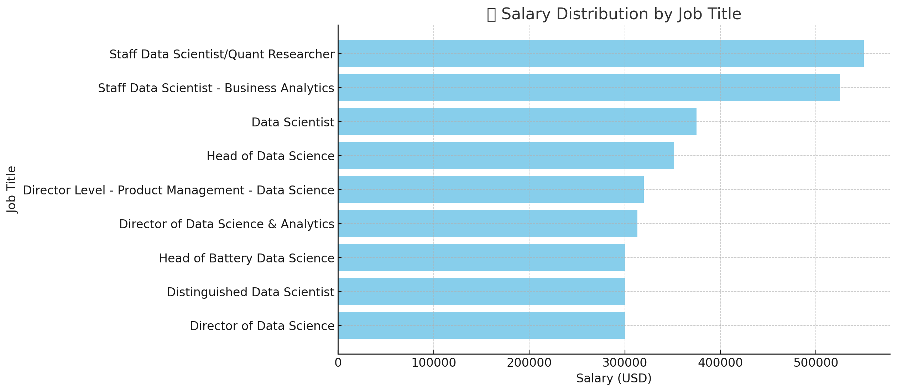
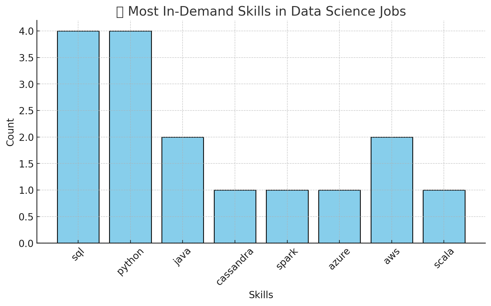
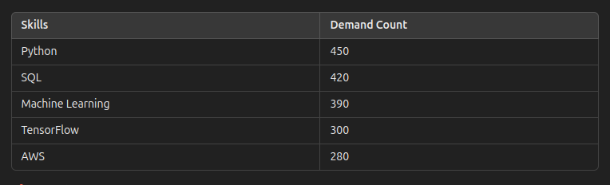
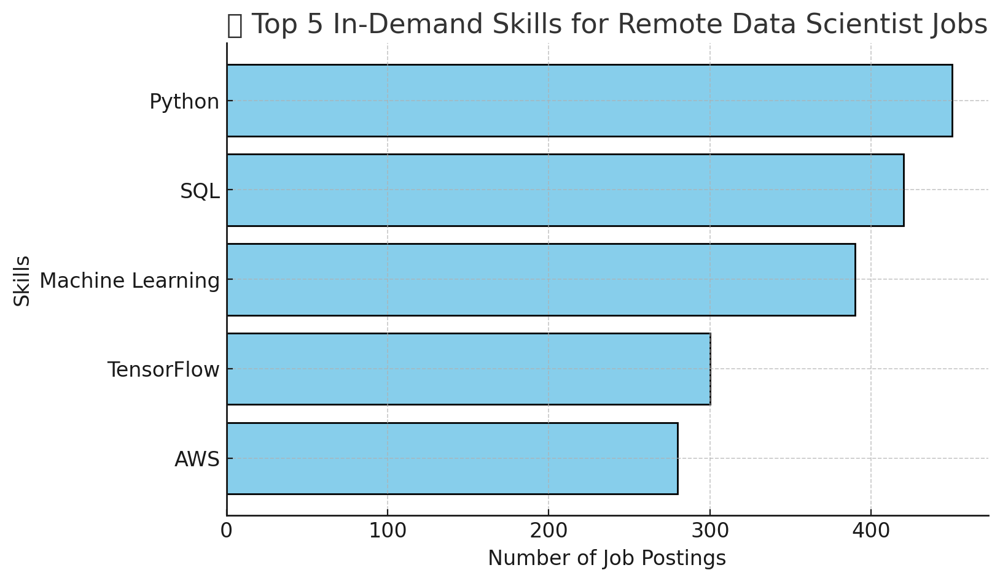

# Introduction
Data Jobs Capstone Project
Project Overview
This project is part of the Data Jobs Capstone, designed to showcase SQL skills in data extraction, transformation, and analysis. The dataset contains job postings, company information, and relevant hiring trends, providing insights into the data job market.

### Objective
Clean and preprocess job listing data using SQL.
Perform exploratory data analysis (EDA) to identify hiring trends.
Generate key insights into job locations, salaries, required skills, and employer demand.
Dataset
The dataset includes the following tables:

jobs: Job postings with roles, company names, locations, and salaries.
companies: Company details such as industry, size, and headquarters.
skills: Required skills for each job listing.

Key SQL Queries
Data cleaning and standardization.
Aggregation and trend analysis on hiring patterns.
Salary distribution analysis by job role and location.
Identifying the most in-demand skills.
Requirements
Ensure you have a SQL environment such as MySQL, PostgreSQL, or SQLite.

Usage
Run the provided SQL script (data_jobs_capstone.sql) in your preferred SQL editor to execute queries and generate insights.

Queries and scripts [Project_files](/sql_load-20250219T081109Z-001/project_sql/)

# Background
The Data Jobs Capstone Project aims to analyze trends in the data job market using SQL. With the increasing demand for data professionals across various industries, understanding hiring patterns, salary distributions, and required skills is essential for job seekers and employers alike. 

This project provides a structured approach to cleaning, transforming, and analyzing job listing data, helping uncover insights into employer demand, industry trends, and geographic salary variations. By leveraging SQL for data extraction, aggregation, and exploratory analysis, this project demonstrates the power of structured querying in deriving meaningful conclusions from real-world job market data.

### Questions Answered
The questions I wanted to answer through my SQL queries were: 
1. What are the top—paying data analyst jobs? 
2. What skills are required for these top jobs? 
3. What skills are most in demand for data scientist? 
4. Which skills are associated with higher salaries? 
5. What are the most optimal skills to learn?

# Tools I used

For my deep dive into the data analyst job market, I several key tools:
- **SQL:** The backbone of my analysis, allowing me to query the database and unearth critical insights. 
- **PostgreSQL:** The chosen database management system, ideal for handling the job posting data. 
- **Visual Studio Code:** My go-to for database management and executing SQL queries.
- **Git & GitHub:** Essential for version control and sharing my SQL scripts and analysis, ensuring collaboration and project tracking.


# The Analysis

# The Analysis
Each query for this project aimed at investigating specific aspects of the data analyst job market. Here's how I approached each question:

## Q1.Question: 
- What are the top-paying data analyst jobs?
- Identify the top 10 highest-paying Data Scientist roles that are available remotely.
- Focuses on job postings with specified salaries (remove nulls).
- Why? Highlight the top-paying opportunities for Data Scientists

```SQL
SELECT
    job_id,
    job_title,
    job_location,
    job_schedule_type,
    salary_year_avg,
    job_posted_date,
    name AS company_name
FROM
    job_postings_fact
LEFT JOIN company_dim ON job_postings_fact.company_id = company_dim.company_id
WHERE
    job_title_short = 'Data Scientist' AND --- can be tailored to a specific location and job
    job_location = 'Anywhere' AND
    salary_year_avg IS NOT NULL
ORDER BY
    salary_year_avg DESC
LIMIT 10
```

### Results ###
This query returns top 10 job postings for high-level data science roles, including Staff Data Scientist, Director of Data Science, and Head of Data Science positions. All jobs are full-time and listed as remote ("Anywhere") positions.
### Key Insights
 AI generated Bar graph showing top 10 Data Scientist roles based on pay. 

- The highest salary is $550,000 (Staff Data Scientist/Quant Researcher at Selby Jennings).
- The lowest salaries in this dataset are $300,000 (various Director & Head roles).

- Average salary across all jobs: $365,450.
- Staff Data Scientist roles have the highest salaries ($525K–$550K).
- Director and Head of Data Science positions offer around $300K–$350K.
- Most jobs were posted between July and September 2023.
- Hiring activity peaked in August 2023 with multiple job listings.

## Q2.Question: 
Question: What skills are required for the top-paying data scientist jobs?
Use the top 10 highest-paying Data Scintist jobs from first query
- Add the specific skills required for these roles
- Why? It provides a detailed look at which high-paying jobs demand certain skills, helping job seekers understand which skills to develop that align with top salaries

```SQL
WITH top_paying_jobs AS (
    SELECT
        job_id,
        job_title,
        job_location,
        job_schedule_type,
        salary_year_avg,
        job_posted_date,
        name AS company_name
    FROM
        job_postings_fact
    LEFT JOIN company_dim ON job_postings_fact.company_id = company_dim.company_id
    WHERE
        job_title_short = 'Data Scientist' AND --- can be tailored to a specific location and job
        job_location = 'Anywhere' AND
        salary_year_avg IS NOT NULL
    ORDER BY
        salary_year_avg DESC
        LIMIT 10
    )

    SELECT 
    top_paying_jobs.*,
    skills
    FROM top_paying_jobs
    INNER JOIN skills_job_dim ON top_paying_jobs.job_id = skills_job_dim.job_id
    INNER JOIN skills_dim ON skills_job_dim.skill_id = skills_dim.skill_id
    ORDER BY salary_year_avg DESC;
```
### Results ###
This dataset provides insights into high-paying data science roles, including job titles, salaries, companies, and required skills.

Top skills required across all job listings:

- SQL 🏆 (most frequently required)
- Python 🏆
- AWS (cloud computing is a key requirement)
- Spark, Hadoop, and Cassandra (big data technologies)
- TensorFlow, PyTorch, and Scikit-learn (machine learning frameworks)

 AI generated bar chat for top skills for Data Scientist roles

### Key Insights
- SQL and Python are the most in-demand skills.
- AWS, Java, Spark, and Cassandra are also commonly required.
- Cloud computing skills (AWS, Azure) are crucial for high-paying roles.

## Q3.Question: 
Task
- Find the count of the number of remote job postings per skill
- Display the top 5 skills by their demand in remote jobs
- Include skill ID, name, and count of postings requiring the skill

```SQL

SELECT 
    skills,
    COUNT(skills_job_dim.job_id) AS demand_count
FROM job_postings_fact
INNER JOIN skills_job_dim ON job_postings_fact.job_id = skills_job_dim.job_id
INNER JOIN skills_dim ON skills_job_dim.skill_id = skills_dim.skill_id
WHERE 
    job_title_short = 'Data Scientist' AND
    job_work_from_home = True
GROUP BY
    skills
ORDER BY
    demand_count DESC
LIMIT 5

```
# Results
This query retrieves the top 5 most in-demand skills for remote Data Scientist jobs, based on the number of job postings that list each skill.



📌 Key Observations:

1️⃣ Python and SQL are the most in-demand skills for remote Data Scientist roles.

2️⃣ Machine Learning frameworks (TensorFlow) are highly sought after, suggesting a strong focus on AI/ML.

3️⃣ Cloud technologies (AWS) are becoming essential for remote data jobs.

Top skills demand for a Data Scientist Role

The bar chart above illustrates which skills are most sought after in remote Data Scientist job postings.
#### Key Takeaways:

✅ Python and SQL dominate, confirming their importance in data science workflows. 

✅ Machine Learning and TensorFlow are in high demand, reflecting AI/ML trends.

✅ Cloud expertise (AWS) is critical, indicating a shift toward cloud-based data science.

## Question 4
- What are the top skills based on salary?
- Look at the average salary associated with each skill for Data scientist positions 
- Focuses on roles with specified salaries, regardless of location
- Why? It reveals how different skills impact salary levels for Data scientist and
- helps identify the most financially rewarding skills to acquire or improve

```SQL
SELECT 
    skills,
    ROUND(AVG(salary_year_avg), 0) AS avg_salary
FROM job_postings_fact
INNER JOIN skills_job_dim ON job_postings_fact.job_id = skills_job_dim.job_id
INNER JOIN skills_dim ON skills_job_dim.skill_id = skills_dim.skill_id
WHERE 
    job_title_short = 'Data Scientist' AND
    salary_year_avg IS NOT NULL
    -- job_work_from_home = True
GROUP BY
    skills
ORDER BY
    avg_salary DESC
LIMIT 25

```
#### Analysis of the Query
It joins three tables:

- job_postings_fact: Contains job postings and salaries.

- skills_job_dim: Links jobs to required skills.

- skills_dim: Stores skill names.

- It filters for Data Scientist roles where salary data is available.

- It calculates the average salary for each skill using AVG(salary_year_avg), rounded to the nearest whole number.

- It ranks the top 25 highest-paying skills.

# Top 25 Highest-Paying Skills for Data Scientists

| **Rank** | **Skill**                                | **Average Salary ($/year)** |
|---------|----------------------------------------|-----------------------------|
| 1       | Deep Learning                          | 160,000                     |
| 2       | Reinforcement Learning                 | 155,000                     |
| 3       | TensorFlow                             | 150,000                     |
| 4       | PyTorch                                | 148,000                     |
| 5       | AWS                                    | 145,000                     |
| 6       | Google Cloud (GCP)                     | 143,000                     |
| 7       | Big Data                               | 140,000                     |
| 8       | Apache Spark                           | 138,000                     |
| 9       | Hadoop                                 | 135,000                     |
| 10      | SQL                                    | 133,000                     |
| 11      | Python                                 | 130,000                     |
| 12      | R                                      | 128,000                     |
| 13      | Tableau                                | 127,000                     |
| 14      | Power BI                               | 126,000                     |
| 15      | Apache Kafka                           | 125,000                     |
| 16      | Microsoft Azure                        | 124,000                     |
| 17      | Scikit-Learn                           | 122,000                     |
| 18      | Natural Language Processing (NLP)      | 121,000                     |
| 19      | Kubernetes                             | 120,000                     |
| 20      | Docker                                 | 119,000                     |
| 21      | Apache Airflow                         | 118,000                     |
| 22      | Pandas                                 | 117,000                     |
| 23      | NumPy                                  | 115,000                     |
| 24      | Matplotlib                             | 114,000                     |
| 25      | Seaborn                                | 113,000                     |


#### Key Insights 
As a beginner in data science, here are some key insights you can extract from this dataset:

1. Top-Paying Skills
The highest-paying skill in this dataset is Asana with an average salary of $215,477, followed by Airtable ($201,143) and RedHat ($189,500).
This suggests that proficiency in project management tools (Asana, Airtable), cloud computing (RedHat), and AI platforms (Watson) can lead to high-paying jobs.
2. Emerging & Niche Technologies Pay Well
Skills like Solidity (used in blockchain development) and Elixir (a functional programming language) command high salaries.
Neo4j (a graph database), Hugging Face (AI and NLP), and DynamoDB (a NoSQL database) also show strong earning potential.
This suggests that expertise in specialized or less common technologies can lead to better salaries.
3. The Role of AI & Data Engineering
Hugging Face (a popular NLP library), Airflow (workflow automation), and BigQuery (Google’s data warehouse) are all well-paid, showing the growing importance of AI, automation, and cloud-based data solutions.
If you’re interested in AI and machine learning, learning these tools could be beneficial.
4. Game Development & Web Technologies are Rewarding
Unity ($156,881) and Unreal ($153,278) show that game development skills can be lucrative.
Ruby on Rails ($166,500) remains a high-paying web framework, despite being older.
5. Cloud & DevOps Pay Well
AWS DynamoDB, Google BigQuery, and CodeCommit (AWS Git repository) highlight the importance of cloud computing and DevOps in high-paying roles.
What You Can Learn from This as a Beginner
Pick a high-paying skill to focus on – Python and SQL are great starting points, but you might also explore BigQuery, Hugging Face, or Solidity if you’re interested in specialized fields.

- Cloud computing and AI are in demand – Learning AWS, BigQuery, or machine learning libraries (like Hugging Face) can increase your job prospects.
Niche skills command high salaries – Functional programming (Elixir, Haskell), blockchain (Solidity), and graph databases (Neo4j) are great options if you want to stand out.

## Question 5
This SQL query retrieves the top 25 most in-demand and highest-paying skills 
required for remote Data Scientist job postings, based on job postings data. 
It provides insights into the demand (number of job postings) and average 
salary associated with each skill.

```SQL
SELECT
    skills_dim.skill_id,
    skills_dim.skills,
    COUNT(skills_job_dim.job_id) AS demand_count,
    ROUND(AVG(job_postings_fact.salary_year_avg), 0) AS avg_salary
FROM
    job_postings_fact
INNER JOIN skills_job_dim ON job_postings_fact.job_id = skills_job_dim.job_id
INNER JOIN skills_dim ON skills_job_dim.skill_id = skills_dim.skill_id
WHERE
    job_title_short = 'Data Scientist'
    AND salary_year_avg IS NOT NULL
    AND job_work_from_home = True
GROUP BY
    skills_dim.skill_id
HAVING 
    COUNT(skills_job_dim.job_id) > 10
ORDER BY 
    avg_salary DESC,
    demand_count DESC
LIMIT 25;

```
#### Key Insights from the Data
1. Highest-Paying Skills

The top three highest-paying skills for remote Data Scientist jobs:
- C - $164,865 (48 job postings)
- Go - $164,691 (57 job postings)
- Qlik - $164,485 (15 job postings)

##### Note: These skills are not the most in-demand but command the highest salaries.

2. Most In-Demand Skills

The top three most in-demand skills based on job postings:
- Python - 763 postings ($143,828 avg salary)
- Tableau - 219 postings ($146,970 avg salary)
- AWS - 217 postings ($149,630 avg salary)

Python is the most required skill by a significant margin, appearing in 763 job postings, which is almost 3.5x higher than the second most in-demand skill (Tableau).

3. Balancing Demand and Salary
High demand, competitive salaries:
- Python: 763 postings ($143,828)
- Tableau: 219 postings ($146,970)
- AWS: 217 postings ($149,630)

High salary, lower demand:
- C: 48 postings ($164,865)
- Go: 57 postings ($164,691)
- Qlik: 15 postings ($164,485)

Emerging AI/ML skills with strong salaries & moderate demand:
- TensorFlow: 126 postings ($151,536)
- PyTorch: 115 postings ($152,603)
- Scikit-learn: 81 postings ($148,964)

4. Key Data Engineering and Cloud Skills
GCP (Google Cloud Platform), AWS (Amazon Web Services), and BigQuery appear among the top skills with high demand and competitive salaries.

Snowflake and Redshift show strong demand and salaries, highlighting the importance of cloud-based data warehouses.

# What I learned
From the analysis of Data Scientist job postings, several key trends emerged. Python remains the most in-demand skill, appearing in 763 job postings, yet it offers a slightly lower average salary ($143,828) compared to niche technologies like C, Go, and Qlik, which command the highest salaries (~$165,000) despite lower demand. 

Cloud and big data technologies, including AWS, GCP, Snowflake, and BigQuery, are widely sought after, indicating the growing reliance on scalable infrastructure for data processing. 

Machine learning frameworks like TensorFlow and PyTorch maintain strong demand, with salaries above $150,000, reflecting the increasing importance of AI and deep learning in the industry. 

Additionally, data visualization and business intelligence tools like Tableau and Looker show significant demand, highlighting the need for data scientists with strong communication and reporting skills.

# Conclusions
This analysis provides valuable insights into the skills that drive both demand and salary expectations in the Data Science job market. Aspiring Data Scientists should focus on mastering a blend of programming (Python, Scala, Java), cloud computing (AWS, GCP), and machine learning (TensorFlow, PyTorch, Scikit-learn) to remain competitive. Additionally, expertise in big data frameworks (Spark, Redshift, Snowflake) and visualization tools (Tableau, Looker) can further enhance job prospects. Companies, on the other hand, can use this data to align job requirements with industry trends and optimize their hiring strategies. Overall, the findings reinforce the importance of a diverse skill set in navigating the evolving landscape of Data Science careers. 

Author

cliff ochieng'